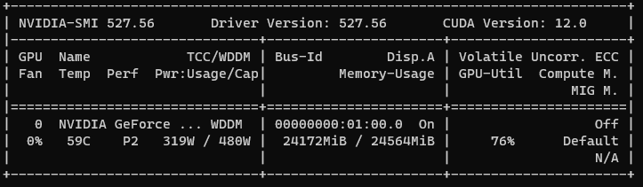

# 無料・商用利用可なオープンソースの大規模言語モデル Dolly 2.0(dolly-v2-12b) を Windowsで試してみた

- **Windows** 環境で [Dolly 2.0](https://huggingface.co/databricks/dolly-v2-12b) を試す方法

  - Linux 環境(Ubuntu 22) で試す方法は [こちら](https://qiita.com/riversun/items/7c45580f1a098b041528)

# 実験環境

- OS: **Windows 11**　(WSL2 などは使わないスッピンの Windows で OK)
- GPU: **RTX 3090** (24GB)
- Python: **Anaconda3 py310_2023.03-0(64-bit)**

# 先にまとめ

- GPUメモリ節約モード `torch_dtype=torch.bfloat16` で起動すれば **RTX 3090** 1枚で推論実行可能。


- Ubuntu 22.04 on g4dn.12xlarge よりも **レスポンスが速い** 印象。 
  - g4dn.12xlargeで遅いのは Tesla T4の性能、accelerate でのGPU分散、AWSの仮想環境などが原因か。


- 12B(120億パラメータ)っていうのが 24GB と相性よいかも。
  - 13B(130億パラメータ)だと、fp16 でも 26GB～ 食うのでコンシューマ用GPU x 1 だときついので。

## STEP 1: Anaconda 仮想環境を作る

dolly-v2 を試すために **env-dolly-v2** という名前で Anaconda 仮想環境を作り python 3.10.10 をインストールする

**conda を最新版にしておく**

```
conda update -n base -c defaults conda --yes
```

**env-dolly-v2** という仮想環境を作り、 python をインストールする

```
conda create --yes -n env-dolly-v2
conda activate env-dolly-v2
conda install python=3.10.10 --yes
```

**pipを最新にしておく**

```
python -m pip install --upgrade pip
```

## STEP 2: 必要パッケージのインストール

以下のように、必要なパッケージをインストールしていく。

```
pip install appdirs Click~=7.0 protobuf~=3.19.0 psutil PyYAML packaging fsspec huggingface-hub pandas tqdm entrypoints jsonschema toolz attrs six dill~=0.3.0
pip install beautifulsoup4
pip install gdown
pip install wandb
pip install torch torchvision torchaudio --index-url https://download.pytorch.org/whl/cu117
pip install accelerate transformers
pip install fastapi uvicorn
```


## STEP 3: ソースコードを記述する

ソースコードをクローンする

```
https://github.com/riversun/dolly-v2-on-windows-ja.git
```

## STEP 4: チャットサーバーを起動する

```
cd dolly-v2-on-windows-ja
python main.py
```


## STEP 5: Dolly 2.0 とお話しする

サーバーが起動した後、ブラウザで http://localhost:8001 にアクセスすると、チャットウィンドウが開くので Dolly 2.0 を試すことができる!

動画  
https://www.youtube.com/watch?v=z8YqlwqNTXI

## GPU メモリ使用量

ほぼ 24GB 使ってる



# Appendix

## ドリーさんに「桃太郎」の続きをつくってもらった

動画  
https://www.youtube.com/watch?v=Bm4oLDWaUAM

**入力文**

```text
Once upon a time, 
there was an old man and an old woman. 
They are an old couple. 
The old man went to the mountains to mow the lawn, 
and the old woman went to the river to wash her clothes. 
One day, when the old woman went to the river,
peaches came down from the upper stream. 

Make up the rest of the story. I need about 300 more words.
```

**日本語意訳**

```text
昔むかし、あるところに老夫婦（おじいさんとおばあさん）がいました。
おじいさんは山に芝刈りにいき、おばあさんは川に洗濯にいきます。
ある日、おばあさんが川にいくと、上流から桃が流れてきました。

このものがたりの続きをつくってください。３００ワードくらいで。
```

**ドリーさんからのレスポンス**

```text
The peaches came down from the upper stream and fell into the river. 
The old woman was washing clothes and the old man was mowing the lawn when the peaches fell down. 
The old man didn't like the idea of peaches in the river, 
so he went to get a boat to go fishing. 
When the old man went down to the lower river to go fishing, 
the peaches asked him to help them get out of the river. 
The old man agreed, and the two went fishing in the middle river. 
There were a lot of fish in the middle river, 
and the old man and the peaches caught many fishes. 
Finally, the old man used his tackle box to catch a giant fish. 
The fish swam to the upper river and the old man and the peaches got out of the river.
```

**日本語意訳**

```text
桃は上流から下ってきて川に落ちました。
桃が落ちたときおばあさんは洗濯をしていて、おじいさんは芝を刈っていました。

おじいさんは桃が川に落ちているのが気にいらなかったので
ボートをとってきて釣りに行きました。

おじいさんが釣りに行くために下流に降りると
桃が「川から上がるのを手伝ってほしい」と言いました。

おじいさんはそれを承諾し、おじいさんと桃は川の真ん中に釣りに行きました。
そこには魚がたくさんいて、おじいさんと桃はたくさんの魚を釣りました。

そしてついに、おじいさんはタックルボックスを使い、
巨大な魚を釣り上げました。魚は川の上のほうまで泳いでいき、
おじいさんと桃は川からあがりましたとさ。
```

## conda コマンド一覧

**仮想環境一覧**

```
conda-env list
```

**仮想環境の deactivate**


```
conda deactivate
```

**仮想環境の削除**


```
conda remove -n env-dolly-v2 --all --yes
```
